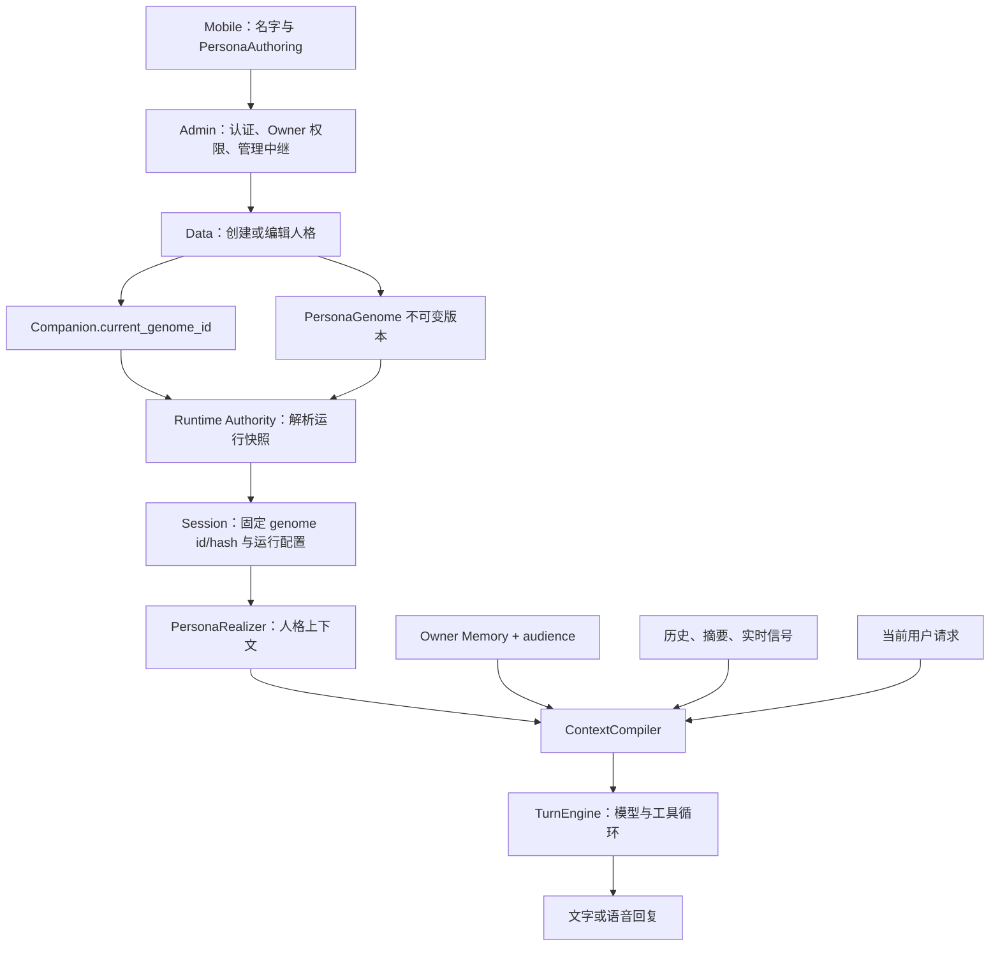

# Companion / Genome / Persona 全链路评审与优化方案

初评：2026-09-09；复核及开始实施：2026-09-10。以下保留原始评审证据；最新实施状态以本节和执行记录为准。保留 F1–F8 编号用于追踪。

## 2026-09-11 自动化验收更新

按用户要求，把联调和体验验收先推进到自动化：完成真实管理 HTTP、真实 Flutter 页面和客户端、三个人格各十轮真实模型、Memory 独立进程和语音场景回归；发现并修复本机调用受系统代理影响、正常历史只有两轮、TTS 大块输入突破单批上限三个问题。详见 [自动化验收记录](./2026-09-11-companion-persona-e2e-acceptance.md)。

原优化方案的代码交付已完成；不能据此宣称整体语音体验已验收。Channel 还有六项已复现的意图/条件句停顿失败，下一步先修软件决策并自动回归，再做隔离 RTC 房间联调，最后补 AEC、蓝牙、后台等真机项。不要把这六项软件失败转交给真机验证。

## 2026-09-10 执行状态

已按授权修改并分别提交 SDK、Data、Admin、Agent、Mobile；尚未推送或部署。[执行记录](./2026-09-10-companion-persona-implementation.md) 包含 API 契约、字段生效表、模型实测和发布约束。

| 发现 / 批次 | 当前状态 |
|---|---|
| F1 / F2 编辑正确性 | 已实现完整 base 合并、人格与偏好双版本检查、持久操作回执、陈旧编辑冲突；Mobile 保留草稿并支持检查后合并 |
| F3 媒介 | 已修复首次 Realizer 调用；无 Memory、空命中、KG-only、有命中四分支测试 |
| F4 回复行为 | 已实现独立偏好和 response_policy.v2；32 场景真实模型 A/B 完成；输出预算默认不硬限，截断原因可诊断；设备音频验收未完成 |
| F5 名字 | 同事务修改 Companion 名字并追加同名 genome；旧会话保持 pin，新会话使用新名字 |
| F6 命令与恢复 | 对外编辑、改名、恢复统一双版本 CAS 与持久操作回执；恢复保留当前名字、回复偏好；Mobile 已接入历史恢复 |
| F7 长期状态归属 | 按最新指示取消迁移，直接删除 genome / 表单 / Realizer 的 commitments、pinned_facts、owner_preferences；事实和具体承诺使用现有 Memory |
| F8 创建和编辑 | 两步创建、三个起点、回复偏好、折叠详细字段，以及使用生产 Compiler/Realizer 的真实模型草稿试聊；不写记忆、不执行工具 |
| 第四批（范围调整） | 默认关闭自动应用，保留共享校验与既有审批；自动成长消费者和长期运营评估不在本轮范围 |

用户最新指示覆盖原迁移计划：不迁移旧数据，不做兼容框架；剩余代码收敛为字段删除、统一写入和草稿试聊。部署与真机语音验收尚未进行。

原计划继续保留这些约束：同一份权威人格、不可变版本、会话 pin、Owner Memory + audience，以及不因编辑设定而隐式启动真实对话。

## 2026-09-10 复核结论（实施前）

**需要更新计划，但原有核心缺陷没有关闭。** 新改动主要改善上下文缓存顺序、记忆读取隔离、语音链路与 Mobile 主机/对话入口；Data、Admin 和 SDK persona 模块未改变，Mobile 的三个 authoring/form/edit 文件也未改变。不能把周边基础设施的进展当作人格编辑已修复。

| 原发现 | 本次状态 | 证据 |
|---|---|---|
| F1 隐藏字段重置 | 仍存在 | 临时真实 Data 库复现：改语气后 trusted→new、偏好清空、evolution false→true |
| F2 陈旧编辑覆盖 | 仍存在 | 重新复现 A 保存语气、B 提交陈旧表单，A 的改动消失 |
| F3 voice 漏传媒介 | 仍存在 | 当前 Compiler 无记忆 voice 输入仍出现 text 标记而无 voice 标记 |
| F4 对话行为策略不足 | 仍存在，补充性能约束 | 缓存排序已落地；回复详略、追问/建议策略和主对话输出预算仍未实现 |
| F5 名字不一致 | 仍存在 | Companion 改名后，新 runtime resolve 的 genome 名仍旧；新版主机可读名称处理的是 Host，不是 Companion |
| F6 两套人格变更语义 | 仍存在 | Data/Admin 无新增提交或工作区改动 |
| F7 多种生命周期混合 | 仍存在 | SDK persona 模块无变化；Memory 执行隔离不等于人格字段归属或自动演化闭环已完成 |
| F8 Mobile 表单复杂 | 仍存在，实施落点调整 | 主机首页和准备页更新，11 个人格字段及原编辑生效文案保持原样 |

计划调整：

1. **将已完成的基础设施作为约束复用。** Compiler 已按 `stable → append_only → volatile → current` 排序；新策略不得把每轮变化的内容塞到稳定人格前缀。历史采用滚动窗口，不能仅凭 `append_only` 分类承诺无限轮次都保持前缀不变。
2. **把回复长度、首响延迟、播放连续性分别验收。** 新 SDK 首音预算为 6 秒；Channel 当前首增量超时为实验用 30 秒，不能声称整条生产链已经统一满足 6 秒目标。Local TTS 的 60 字符是单批限制，不是整轮回答长度上限。
3. **在新 Mobile 入口内简化人格创建，不重做主机导航。** 保留准备页的伙伴选择、PTT/半双工/全双工、明确开始动作和通话更换确认；人格试聊不能隐式批准设备、改绑或打开麦克风。
4. **第一批同时建立真实模型测量基线，但不阻塞确定性修复。** 先修 F1/F2/F3/F5；行为 A/B 按模型、冷/热前缀、记忆状态和通话模式分组。无需等待 UI 重构或硬件性能达标才修编辑正确性。

以下目标架构和四批次方案已同步修改，不另保留一份与正文冲突的计划。

## 结论

Eidolon OS 的主体边界值得保留：Companion 是长期身份，Data 是权威数据源，Agent 是运行时，Memory 是 Owner 的记忆资产，Body/Channel 是交互载体。不可变人格版本与会话固定版本也是正确的基础。

问题集中在三个地方：

1. **人格、关系事实、对话偏好和运行策略混在同一份 genome 内，写入和生效机制不一致。** 用户只是想“少说一点”，却被迫理解人格画像、行为引导和表达画像。
2. **创建和编辑更多是在暴露内部字段，而不是帮助人决定伙伴的行为。** 预填值、共用表单和只要求名字是优点，但把 11 个人格字段分成四步，仍然是复杂表单。
3. **一些正确的架构意图没有被代码保证。** 已复现隐藏字段重置、陈旧编辑覆盖、语音媒介规则漏传、改名与对话身份不同步。应该先修这些，再谈自动人格演化。

不建议推翻 OS 边界，也不建议再建一组 Persona/Genome 微服务。推荐在现有项目内收敛命令路径，明确状态归属，增加小而明确的对话偏好与本轮策略。

## 评审范围与证据强度

检查了 Agent、SDK、Data、Admin 管理中继、Mobile 创建/编辑，以及多 Companion 架构方案和记忆隔离裁决。核心项目基线：

| 项目 | 09-09 初评 | 09-10 复核 |
|---|---|---|
| eidolon_agent | bc04ea6 | 7247e5d |
| eidolon_sdk | bcefd6d | bfb9441 |
| eidolon_data | b1ab026 | b1ab026，无工作区改动 |
| eidolon_admin | 35a7f96 | 35a7f96，无工作区改动 |
| eidolon_client_mobile | 639dd54，另有未提交修改 | 99c2800；复核开始为 e2bdbcb + 地址候选工作区修改，收尾时已提交；另有路由评审文档修改 |

本次补看与方案有关的 Channel `cecc1f9`（复核开始为 `6f24bfb` + provider 信令地址工作区改动，收尾时已提交）、Memory `a250317`、Kernel `41ed793`、Models `6b7938c`。这是定向检查相关差异，不是对这些项目的全量审计；Kernel 网络生命周期与 Models CPU 调度没有在本次重新做硬件验证。

初评和复核阶段未修改其他项目的源文件；随后已按用户授权实施上述跨项目变更。没有读取正在运行的某个 Companion 的实际 genome、模型请求或真实聊天 transcript，也没有操作手机 UI。因此：下面的代码缺陷有直接证据；对用户当前“啰嗦”的原因是机制层诊断，不能声称已定位某个线上会话的唯一根因。

验证：

- 使用真实 SDK/Data/Agent，在临时 SQLite 中完成最小复现，未触碰用户数据库。
- 09-09 运行原 Persona/Compiler/Registry 三组测试：**53 passed**，仅作为初评记录。
- 09-10 重新运行上述三组，并增加 `test_prefix_order.py`、memory `test_discovery.py`/`test_mcp_client.py`：**97 passed**。
- 09-10 运行 Mobile `persona_edit_test.dart`、`companion_lifecycle_test.dart`、`conversation_modes_test.dart`、`product_conversation_flow_test.dart`：**31 passed**，执行时为 e2bdbcb 加当时的工作区；收尾核对 99c2800 提交仅涉及既有地址候选改动，未改变人格表单。其中表单 round-trip 测试无法证明 Data 保存完整 genome 不丢字段。
- 09-10 使用真实 Data/SDK/Agent 临时 SQLite 再次复现 F1/F2/F3/F5；没有向用户数据库或在线服务写入。
- 这些测试是确定性逻辑验证，不等于真实模型对话质量、移动端可用性或部署 E2E 验收。

## 新增实现及其对计划的约束

| 更新 | 已存在的实现 | 本计划应如何使用 |
|---|---|---|
| Agent `ed6c4eb` | [Compiler 排序](/Users/manson/ai/eidolon/eidolon_agent/eidolon_agent/domain/context/compiler.py:584) 根据 [段易变性](/Users/manson/ai/eidolon/eidolon_agent/eidolon_agent/domain/context/types.py:47) 推导顺序；稳定人格/Harness 在历史之前，易变状态在后，当前请求最后 | 保留排序、预算裁剪和当前请求优先性；新增 reply policy 标明易变性，测试偏好变化不会污染稳定前缀；测量滚动窗口和话题切换下的实际缓存复用 |
| Agent `7247e5d` + Memory `a250317` | 探测健康不再等于路由准入；Memory 模型执行隔离到子进程，runner 保有唯一存储权威。见 [执行边界](/Users/manson/ai/eidolon/eidolon_memory/docs/MODEL_EXECUTION_BOUNDARY.md:1) | 已有修复不重复开发；保留真实超时和 Realm 禁用检查。空库/无命中/慢抽取/读取失败分别测试，不能用新增人格 fallback 掩盖记忆链路状态 |
| SDK `cfc2e1b` + Channel `28545b1`、`d26f7b3` | [首音预算](/Users/manson/ai/eidolon/eidolon_sdk/eidolon_sdk/biz/contracts/turn_latency.py:49) 6 秒，份额为识别 2.7、生成 1.2、声音 2.1 秒；[当前首增量超时](/Users/manson/ai/eidolon/eidolon_channel/eidolon/livekit/agent/eidolon_agent_rpc/grpc_llm.py:58) 为冷 prompt 实验改为 30 秒 | 产品目标与失败超时分列；发布配置需明确实验超时如何管理，不能不测冷启动就直接缩到 2.4 秒，也不能将 30 秒当作达标目标 |
| SDK Local TTS + Channel `8d544f7`、Models `3d111cb` | [LocalTtsConfig](/Users/manson/ai/eidolon/eidolon_channel/eidolon/livekit/plugins/tts/local_tts/config.py:18) 已按 SAFE_TEXT_CHARACTERS=60 校验分批；MAX_TEXT_CHARACTERS=400 是请求拒绝上限；服务报告 minimum_buffer_ms | 复用已有分批，禁止截断完整回答以满足单批上限；验收跨批接续、总时长及缓冲下穿。缺少报告不等于无断音；本地实现限制不硬编码进云 TTS 或人格 |
| Mobile `7ec78c5`、`1bfdf1b`、`7fa1269` 及后续网络修复 | 主机首页与管理入口统一；准备页选择伙伴与三模式，开始时才确认关联和入房；同 Owner 多 Host 复用 Device，跨 Owner 隔离。见 [已实施的 UX 方案](/Users/manson/ai/eidolon/eidolon_client_mobile/docs/my-eidolon-ux-final-plan.md:1) | 在现有伙伴管理入口改表单；不增加第二个首页、对话 launcher、地址缓存或 Device 身份；三模式是轮次/收音控制，不是 persona 的三种性格 |

表中的实现状态来自代码/提交；其他文档中的硬件实测为既有记录，不计为本次新测结果。动态信令/网络候选在复核期间提交为 Mobile `99c2800`、Channel `cecc1f9`；[网络变动方案](/Users/manson/ai/eidolon/eidolon_client_mobile/docs/review/runtime-network-inputs-2026-09-10.md:1) 明确区分代码验证与尚未完成的部署/换网验收。本方案约束人格流程复用现有身份和路由能力，不据此宣布网络音频验收完成。

## 当前链路：哪些是对象，哪些是过程

| 概念 | 当前实际职责 | 应保持的解释 |
|---|---|---|
| Companion | ID、Owner 归属、名字、生命周期、current_genome_id、runtime_config | 用户长期拥有的一个伙伴 |
| PersonaGenome | SDK 结构；Data 存储不可变版本 | 对伙伴人格设定的版本化描述 |
| PersonaAuthoring | Mobile 与管理 API 使用的可写字段投影 | 编辑输入，不应成为第二份权威人格 |
| PersonasService / PersonaRealizer | 读取固定 genome，拼装人格上下文 | 将人格呈现给模型的过程，不是另一个人格实体 |
| CompanionAgent / AgentInstance | 按 owner + companion + genome 创建的运行实例 | 一个伙伴可以有多个版本运行实例、多个会话 |
| Memory Realm | Owner 级记忆；Companion 参与 audience 过滤 | 一份记忆资产，不因新建伙伴复制一份数据库 |
| Session / Turn | 固定运行快照；每轮组合请求、人格、记忆、历史、策略 | 执行和交互边界 |
| Runtime state | 情绪、精力、注意力，进程内短期状态 | 不属于长期人格版本 |

创建从 Data 的 `owner_workspace.py` 构建 genome 并落库；编辑则进入 `PersonaRepository.author()`。这两条路径共用了“从默认值构建新 genome”的函数，正是隐藏字段重置的来源。

自动演化目前不是完整生产闭环。生产 bootstrap 只有 Runtime Authority 读取；演化命令与 observation sink 仅在 local System Data 存在时注入。观察→提案→批准有领域实现和测试，但不能把它描述成线上伙伴已经会自主成长。

## 发现与优先级

### F1 · 高：编辑一项会重置未展示字段，已复现

证据：[Data author](/Users/manson/ai/eidolon/eidolon_data/eidolon_data/repositories/persona.py:77)、[SDK builder](/Users/manson/ai/eidolon/eidolon_sdk/eidolon_sdk/biz/persona.py:343)、[编辑投影](/Users/manson/ai/eidolon/eidolon_sdk/eidolon_sdk/biz/persona.py:388)。

`author()` 把当前 genome 投影成 authoring 后，保存时重新调用创建 builder；builder 以默认 genome 为基础，未合并完整的当前 genome。Mobile 保留了 traits/modality_notes，但无法保留根本不在 Authoring 合同里的字段。

将表达画像改成“自然简短”，复现结果：

| 非编辑目标字段 | 保存前 | 保存后 |
|---|---|---|
| relationship.stage | trusted | new |
| relationship.owner_preferences | response_length=brief | 空 |
| expression.signature_phrases | 自定义委托提示 | 空 |
| character.tensions | 有内容 | 空 |
| evolution_policy.enabled | false | true |
| memory_policy.recall_policy | use_memory_as_evidence=false | 默认 true |

`growth_edges`、relation_policies 等同样没有被当前 builder 保留。不是每个新伙伴都会马上显现：默认状态恰好等于重置后的状态时，现有测试很容易通过。

**建议：创建和编辑分开。** 创建可用默认 builder；编辑必须以完整 base genome 为基础，只应用本次明确修改的字段。缺省表示保持，空数组表示清空，不用客户端回传隐藏字段承担保真责任。再验证完整候选、生成新版本。

### F2 · 高：编辑没有 base revision，陈旧保存覆盖新内容，已复现

证据：[AuthoringRequest](/Users/manson/ai/eidolon/eidolon_data/eidolon_data/api/companion_authority.py:106)、[Mobile PUT](/Users/manson/ai/eidolon/eidolon_client_mobile/lib/src/management/management_client.dart:845)、[Data author](/Users/manson/ai/eidolon/eidolon_data/eidolon_data/repositories/persona.py:77)。

A、B 同时读取 v1；A 改语气并保存；B 改性格并提交旧的完整表单。B 保存成功，A 的语气消失。无需数据库同时写入，仅仅先后保存就会发生。

当前“内容相等则不新增版本”只能处理没有中间更新的简单重试。A 保存成功、B 更新、A 丢响应后重试，仍可能把 B 覆盖。

**建议：** 读取返回 revision/genome id；写入带 `expected_base_genome_id` 和 `operation_id`。Data 在同一事务内检查 base、写版本、更新指针与审计。陈旧请求返回明确 409；同一操作重放返回原结果，不重新执行。Mobile 保留草稿并展示冲突差异。

### F3 · 高：语音是否使用语音人格规则，意外依赖记忆命中，已复现

证据：[首次 realize 调用](/Users/manson/ai/eidolon/eidolon_agent/eidolon_agent/domain/context/compiler.py:120)、[命中后的二次 realize](/Users/manson/ai/eidolon/eidolon_agent/eidolon_agent/domain/context/compiler.py:242)。

首次 `realize_context()` 没传 `modality`，默认 text。仅在 `memory_hits` 非空时，`apply_memory_evidence()` 传入真实 `ti.input_modality`。

给 genome 设置不同的 text/voice 标记，以 voice 输入且无记忆编译，最终 prompt 包含 text 标记、不含 voice 标记。冷启动、召回无命中、仅有 KG/context 等没有 hit 对象的情况，都可能走到错误分支。

**建议：** 首次调用始终传媒介；有无记忆只决定记忆上下文，不能决定表达策略。后续可把一次固定快照加载结果传给 memory adaptation，减少第二次 Data 请求；保留会话准入与撤销检查，不以永久缓存替代授权。

### F4 · 高：缺少可执行、可验证的对话行为策略

证据：[默认行为引导](/Users/manson/ai/eidolon/eidolon_sdk/eidolon_sdk/biz/persona.py:32)、[Harness](/Users/manson/ai/eidolon/eidolon_agent/eidolon_agent/domain/harness/realtime.py:119)、[LLM 调用](/Users/manson/ai/eidolon/eidolon_agent/eidolon_agent/domain/agent/turn.py:304)、[RuntimeConfig](/Users/manson/ai/eidolon/eidolon_agent/eidolon_agent/core/types/companion_runtime.py:14)。

- 默认引导含“先回应……再补充建议”，容易把建议变成每轮附加内容。这是合理怀疑，需要真实模型 A/B 验证。
- Harness 已经要求简短，所以不是“系统完全没说要简洁”；问题是没有按情境定义何时结束、何时追问、何时提供建议。
- RuntimeConfig 有 model、temperature、tools，没有 reply length、follow-up、advice 等独立偏好。
- 主对话 LLM 调用没有传 max_tokens；Harness 的 output reserve 是上下文预算参数，不能视为生成长度上限。
- 人格 prose 全部作为不可丢弃稳定段进入 prompt。自定义设定很长时，没有字段级额度或例句选择机制。

测量默认“小南”：稳定人格文本 **218 字符**，Harness **767 字符**，不含记忆、历史、标签、工具 schema。这是字符数，不是 tokenizer 结果。默认人格本身并不庞大；不能以“压缩 genome”替代回复行为设计。

上述字符数为 09-09 测量；相关默认设定和 Harness 本次没有变化。09-10 的缓存排序优化改善模型读取上下文的成本，并未改变默认回复合同。首增量超时、SDK 首音预算、TTS 单批长度和 LLM 完整回复预算是不同指标，不能互相替代。

**建议：** Data 保存明确对话偏好，Agent 每轮派生 response policy。先定义少量产品概念：详略、建议倾向、追问倾向；具体句数、输出预算、模型参数由 Agent 管理。不要把这些实现参数全部搬进 Mobile。

### F5 · 中：改名与运行时自我身份分裂，已复现

证据：[rename](/Users/manson/ai/eidolon/eidolon_data/eidolon_data/repositories/companions.py:65)、[自我身份 prompt](/Users/manson/ai/eidolon/eidolon_agent/eidolon_agent/domain/personas/realizer.py:90)。

rename 只更新 `Companion.display_name`；模型身份使用 `genome.constitution.name`。最小复现：名册为“新名字”，新 runtime resolve 得到的 genome 仍叫“旧名字”。编辑人格还刻意保留旧 genome 名。

**近期建议：** 如果当前产品的“改名”就是改伙伴名字，应通过一个 Data 命令原子更新 display_name 并追加包含新名字的 genome，旧会话保持旧快照。恢复旧人格时保留当前名字，除非动作明确包含恢复名字。

**长期建议：** CompanionIdentity 成为名字唯一权威；Persona 通过 companion_id 关联，export 时组成完整伙伴资产。若确有“显示别名”和“自我名字”两个产品概念，必须明确命名并分别展示，不能隐式分叉。

### F6 · 中：同一权威内部有两套人格变更语义

证据：[Repository author/restore](/Users/manson/ai/eidolon/eidolon_data/eidolon_data/repositories/persona.py:77)、[PersonaService](/Users/manson/ai/eidolon/eidolon_data/eidolon_data/services/persona_service.py:28)。

- 管理编辑/restore：Repository 直接写版本、移动指针；restore 追加新章节。
- 演化 approve/rollback：PersonaService 写事务和 governance event；rollback 直接把指针切回历史版本。
- Repository 的 author/restore 没有与 PersonaService 同样的 governance event 写入。
- `approve_evolution` 的 expected base 在 Data service 中可省略。当前 Agent facade 会要求它，但权威本身没有彻底收紧约束。

这不是两个独立数据源，而是**同一个 Data 权威内有两套命令实现**。它们的审计、冲突、恢复语义已经不同。

**建议：** Data 内保留一个 PersonaCommandService，Repository 回归读写存储。owner edit、restore、evolution approve 共用“校验→写候选/版本→切指针→审计”事务原语，保留不同的权限和业务校验。历史恢复统一采用追加新版本，记录 previous active revision 与 restored-from revision，避免把两种来源都塞进 base_genome_id。

### F7 · 中：Genome 承担了多种生命周期；部分字段只有存储意义

证据：[Genome 类型](/Users/manson/ai/eidolon/eidolon_sdk/eidolon_sdk/biz/persona.py:48)、[Realizer](/Users/manson/ai/eidolon/eidolon_agent/eidolon_agent/domain/personas/realizer.py:90)、[演化校验](/Users/manson/ai/eidolon/eidolon_agent/eidolon_agent/domain/personas/service.py:234)。

Genome 同时包含稳定价值观、关系阶段、Owner 事实/偏好、承诺、记忆策略与演化策略。ContextCompiler 又从 Memory 读取 active commitments。两处都叫 commitments，但一处是关系约定文本，一处有状态/期限/参与人，边界不明显。

traits 被明确设计为非执行的演化坐标。复现只修改 extraversion 数值，稳定 prompt 完全不变。这不是“滑块坏了”——Mobile 也没暴露滑块——但不能把 traits 的数值变化称作已经改变对话性格。自动演化若只改数值，不改语义表达，会出现版本增加、行为不变。

演化策略虽然默认 enabled/auto_apply_low_risk=true，但生产闭环未启用。Agent 的 `_validate_evolution` 也只检查部分不变量，未完整执行 enabled、review_required_traits 等策略；将来接通前必须补权威校验。

**建议：** 区分稳定人格、关系约定、可证实记忆、对话偏好、工具权限与短期状态。保留关系约定在 Persona 中；用户事实和带期限承诺归 Memory；请求执行与进度仍归任务运行时。traits 暂时明确为内部观察指标，删除“数值必然驱动行为”的暗示。默认不宣称自动成长已启用。

### F8 · 中：Mobile 输入成本高，反馈不足，生效承诺不准确

证据：[四步创建](/Users/manson/ai/eidolon/eidolon_client_mobile/lib/src/management/companion_authoring_page.dart:58)、[共用表单](/Users/manson/ai/eidolon/eidolon_client_mobile/lib/src/management/persona_form.dart:19)、[编辑页](/Users/manson/ai/eidolon/eidolon_client_mobile/lib/src/management/persona_edit_page.dart:108)。

实际展示 4 个 prose 字段和 7 个列表字段，另加名字。自我认知/人格画像、价值观/两类边界、表达画像/行为引导/对话示例，普通用户很难预判各自作用。同一个“少追问”可以被写进多个位置。

09-10 已确认：主机导航改善没有改动这些表单。新版 `HostLocalConnectionPage` 仍打开相同 `PersonaEditPage`，保存后刷新 Workspace；刷新卡片不等于刷新正在运行的 Agent session。Host 可读名称修复与 F5 的 Companion 名字同步是不同对象。

应保留的优点：服务器返回默认模板、仅名字必填、未改模板可省略、创建与编辑共用字段实现、从当前设定打开编辑、无变更不创建版本。

需要改变：

- 四步向导仍要求用户经过复杂概念，没有直接“用这个起点创建”的主要路径。
- 确认页是在复述表单，并未展示这个伙伴实际怎样回答。
- 编辑文案“改了之后它就是这样”与会话固定旧 genome 的语义不一致，没有显示当前会话的生效状态。
- 当前字段允许长 prose/长列表，但缺少输入预算和冲突反馈。

## 目标架构：少几个混合职责，不多几个服务

| 内容 | 权威归属 | 版本/生效方式 |
|---|---|---|
| CompanionIdentity：名字、身份、生命周期 | Data | 身份 revision；会话快照明确固定 |
| PersonaDefinition：性格、价值观、表达气质、关系约定 | Data | 不可变 revision，新会话或受控切换生效 |
| ConversationPreferences：详略、建议/追问偏好 | Data | 可版本化偏好；在下一 turn 边界应用并记录 revision |
| Memory：Owner 事实、偏好证据、经历、具体承诺 | Memory | Owner Realm + audience；支持纠错、遗忘 |
| RuntimeConfig：模型、工具授权、执行额度 | Data/现有治理命令 | Session 固定；撤销按已有安全机制处理 |
| ResponsePolicy：本轮目标长度、媒介限制、是否追问 | Agent 派生 | 每轮计算，不回写 genome |
| 短期情绪/注意力 | Agent runtime | 短生命周期，不写长期人格 |

这些先是领域边界；第一轮实现不要求新增六张表、更不要求新建服务。可在现有 Data 聚合内增加结构化偏好与 revision，在 Agent 内增加薄的策略解析函数。

ResponsePolicy 接入现有 ContextSegment 分类：会话固定的人格仍在稳定段；由当前请求、媒介、偏好覆盖派生的策略放到适当的易变段，当前请求仍最后。不要把每轮变化的 revision、状态提示混进 stable persona。配置更新应在 turn 边界原子取快照；Mobile 的 PTT/半双工/全双工继续由现有 Channel/Device 轮次控制处理，不能等同于 text/voice 模态，也不能通过人格 prose 改写收音授权。

PersonaDefinition 不必立刻替换所有 PersonaGenome 名称。Genome 可以继续作为导出与不可变存储容器；关键是不要再让它混合所有可变事实，也不要在 UI 展示内部版本/hash。

**策略优先顺序应明确：** 系统安全/工具权限 → 当前用户明确意图 → 本次会话覆盖 → 用户显式对话偏好 → 伙伴默认表达 → 召回偏好证据。后四者只控制风格和详略，不能扩大权限；用户要求“详细说明”时不应被全局“简短”截断。显式偏好不应依赖向量检索是否命中。

Realizer 分离模型无关的人格语义与模型相关的实现。schema/realizer 当前标识只是常量字符串；应增加真实 revision，并在内部诊断记录 genome hash、realizer revision、harness revision、偏好 revision、model id 和有效 response policy，才能解释“同一人格为什么升级后说话变了”。不需要默认记录完整私密 prompt。

## 先解决啰嗦：建议的初始行为合同

以下是待 A/B 校准的产品默认值，不是已经测得的最佳阈值：

| 场景 | 建议默认行为 |
|---|---|
| 问候、确认、收到 | 一句，完成即结束 |
| 普通语音问答 | 1–3 个短句，一次回应一个重点 |
| 普通文字问答 | 一个短段落，必要时少量要点 |
| 情绪表达 | 简短接住情绪；不默认重复复述、诊断或给计划 |
| 用户明确要建议 | 给少量具体建议，不自动附上下一轮推销式问题 |
| 缺少完成任务所必需的信息 | 最多问一个关键澄清问题 |
| 用户要解释、比较、详细方案 | 按任务所需展开，允许覆盖简短默认 |
| 工具完成 | 一次报告结果；提示失败时给可用下一步，避免重复播报 |

建议的基础措辞：

> 先直接回应当前内容。普通对话说够就停，不默认补建议或追问。需要澄清才能完成请求时，只问一个关键问题。用户明确要求详细解释或建议时再展开。保持伙伴自己的语气，避免重复复述用户原话。

具体落点：

1. SDK 默认指导删除无条件“再补充建议”，更新新建默认；现有自定义人格不能批量覆盖。
2. Agent 每轮给出明确的 ResponsePolicy，修正 voice 传参；语音和文字各自有目标长度。
3. 给 Provider 接入模型适配后的输出预算，作为兜底。区分可见输出与模型推理额度，检查 finish_reason，不能只设一个很低的 max_tokens 造成半句话或损坏工具调用。
4. 不做每轮第二次 LLM 改写压缩，不在 TTS 已开始后硬裁剪。它们会增加延迟或制造内容不一致。
5. 人格压缩在 author/commit 时可确定性处理，限制冗余、示例数量；不每轮让模型重新总结人格。硬边界与当前请求不能被随意裁掉。

6. 沿用 Channel 已实现的 Local TTS 分批：长回答可以分成多个不超过当前 provider 安全长度的批次，保留全文。不得把 SAFE_TEXT_CHARACTERS=60 变成“所有人格最多说 60 字”的规则；也不为本计划再建一个分句器。
7. 冷/热模型首响、TTS 首帧和连续播放分别记录。当前 30 秒首增量实验超时不影响“正常闲聊应简短”的行为要求；其恢复为产品配置需要独立的冷启动成功率和取消/恢复验证。

同一句“今天有点累”，默认可回答“今天辛苦了，先歇会儿吧。”；具体伙伴仍可以更活泼或更克制。并非每个回应都必须变成“共情一段→三个建议→你愿意聊聊吗”。这只是目标示例，不是对线上回复的转录。

## Mobile：把创建改为决定行为，而不是填写领域模型

实施位置是新版主机首页已有伙伴管理/创建/编辑入口，沿用 [Mobile 已实施方案](/Users/manson/ai/eidolon/eidolon_client_mobile/docs/my-eidolon-ux-final-plan.md:1)。不再重构主机主页、发现或对话导航。人格的“试聊”和准备页的“开始真实对话”语义分开，复用同一人格编译能力，不复用会产生 Device 关联或收音副作用的开始动作。

推荐主流程为两步，并提供直接使用默认的路径：

**第一步：起个名字，选一个起点。** 例如“温和陪伴 / 直接务实 / 活泼有趣”，加可选的一句话描述。起点由 Data 返回版本化 preset；名称和范例可以再做产品验证。用户可以原样创建，也可以打开详细设定。

**第二步：看看 TA 怎么说话。** 展示 2–3 个短场景，例如“你好”“我今天很累”“帮我做个选择”；提供“回复短一点”“少主动给建议”“少追问”的明确选项，确认后创建。

第一次可使用明确标为示例的 preset 对话；动态试聊必须通过 Agent 同一 Realizer/Harness，以未提交草稿做隔离预览，不调用执行工具、不写长期记忆、不创建正式伙伴。服务端返回 draft revision/digest，提交同一份经过预览的内容；无法动态预览时仍能创建，不能让它成为新瓶颈。

一句话描述先直接进入一个语义字段，不需要强制额外调用 LLM 拆成十几个字段；未来加入“帮我润色设定”时应可选并让用户看到修改结果。

创建后的编辑入口：

- **性格与说话方式**：一句话画像、语气、详略、建议与追问；可试聊。
- **相处约定**：关系期待、称呼、互动边界；不要让用户填写“已达到 trusted”。
- **关于我的记忆**：事实、偏好、承诺，进入已有 Memory 治理界面，明确适用范围。
- **详细设定**：保留自我认知、价值观、例句等自由创作能力，不必在首次创建全部出现。

不让用户同时维护“genome”和“persona”两套内容。前者是内部存储/版本术语，后者在 UI 中用“性格与说话方式”表达即可。

保存后反馈要准确：人格更改显示“已保存，下次对话使用”；在支持受控 session 切换后再提供“本次对话也使用”。对话偏好可在新增 turn-boundary 机制后下一条生效。无论哪种，都不重写历史消息，不在流式回答中途换规则。

第一版采用已存在的“结束当前对话→回准备页→明确开始”路径应用新人格，不另造无确认的热切换。选择伙伴/通话模式只修改准备草稿，通话中的更换保留结束确认；保存人格本身不能触发设备批准、assign 或 Room join。仅在协议与运行时支持版本交接后，才提供会话内受控切换。

偏好、草稿和预览使用稳定的 Owner + Companion 标识；不能按主机 IP 保存，不把一次 Host 路由切换当作新用户或新人格。复用现有网络定位和 Owner 身份边界，不新建旁路客户端。

## 实施顺序与验收

### 第一批：修正确性与回复行为基线

涉及 SDK、Data、Agent；Mobile 只配合准确文案及必要 revision 传递。

第一批保留原优先级，分为正确性修复和行为/性能测量两条工作线。Channel、Models 参与后者；可用硬件不足不阻塞确定性修复。缓存排序、记忆执行隔离和 Local TTS 分批已存在，列为回归约束，不重复开发。

- 修复 voice modality；覆盖无 Memory、空 hits、KG-only、正常 hits 四种分支。
- author 在完整 base 上应用改动；保留隐藏字段；将 expected base 与 operation id 贯穿管理 API。
- 确定名字唯一含义，修复 rename 与新会话人格的一致性。
- 收敛默认回复指令，加入薄的 response policy；不动用户自定义内容。
- 拿实际部署模型和实际 Companion 设置跑小规模 A/B，核对当前会话问题。
- A/B 固定 genome/model/policy 版本，分开冷启动、热前缀、Memory 无命中/健康/降级及三种通话模式，记录首响、完整输出、TTS 跨批和取消结果；实验超时单独标记。

退出条件：修改一句话仅改变预期路径；陈旧保存明确冲突；丢响应重试不重复执行；语音规则不随 memory 命中变化；改名后新会话一致；已有 pin/isolation 测试继续通过。

性能优化不能以截断、漏播或静默放大超时换取通过。正文新增策略不破坏已实现的段排序；在历史窗口滑动、话题切换、偏好更新时分别验证上下文含义与缓存收益。

### 第二批：让用户能配置、预览、确认生效

- Data 管理显式 ConversationPreferences；Mobile 主流程简化为起点+试聊，详细字段折叠。
- draft 预览和正式创建共用构建/Realizer 路径；预览隔离执行工具和记忆写入。
- 偏好在 turn 边界应用；展示 saved revision 与当前会话 revision 的关系。
- 加入用户能理解的历史差异和冲突恢复，不依赖“章节”隐喻解释所有操作。
- 沿用现有主机主页/伙伴管理和准备页三模式；保存/预览不得产生 Device 批准、改绑、入房或麦克风发送。覆盖不同 Owner 往返与同 Owner 多 Host 场景中的草稿归属和旧结果丢弃。

退出条件：只填名字也能迅速创建；“少说一点”有明确入口、可预览、下一轮能观察到；无副作用预览；表单不再要求用户理解 genome 结构。

### 第三批：收敛命令与长期状态归属

- author/restore/evolution 统一 Data 命令服务、CAS、审计和恢复语义。
- 将 pinned facts、显式偏好、具体承诺迁出人格语义；保持 Owner Realm + audience 裁决。
- 最新范围：不迁移旧数据；直接删除旧字段及读取。新事实/具体承诺沿用现有 Memory 权威；不把关系叙述自动转成待执行任务。
- 增加 realizer/policy revision；建立“字段→读取者→生效点→测试”清单，删除无效契约或明确仅作观察的字段。

退出条件：每类事实只有一个权威写入处；恢复历史人格不复活已经遗忘的用户事实；所有人格命令具备一致的审计、并发和重试保证。

### 第四批（已调整为默认关闭自动应用；以下为未来启用条件）：有质量证据后再启用自动演化

- 把观察、用户偏好变更、稳定人格演化分别处理。
- 默认保守启用；身份、价值观和关系约定不得被记忆反思静默重写。
- Data 权威执行 enabled、允许变更路径、审阅规则、证据要求和 base 检查；不能仅依赖 Agent 调用前校验。
- 数值指标变化必须有明确的语义结果或明确标为仅观测；不能用版本数当成长指标。

退出条件：跨进程闭环验收完成，长期一致性和用户可撤回能力通过，才向产品宣称自动成长。

## 对话质量验收，避免“测试绿了但仍然啰嗦”

建立约 30–50 个固定场景，覆盖问候、事实问答、情绪表达、明确要建议、详细解释、任务委托、工具失败、打断、记忆降级，以及连续 10 轮的闲聊。每种人格用同一场景对比，以区分人格差异与全局回复策略。

| 维度 | 观察方式 |
|---|---|
| 详略适当 | 按场景统计字符/句数/语音时长；明确要求长答的单独计分 |
| 多余建议与追问 | 人工抽样标注是否必要，比较 A/B 比例 |
| 重复 | 重述用户输入、重复工具播报、结尾模板化的频率 |
| 内容完整性 | 简短后是否漏答、硬截断、无法完成任务 |
| 人格可辨识 | 不看名字，是否仍能从表达辨认不同伙伴 |
| 性能 | 按模型/硬件与冷/热前缀分组，统计首 token、首音频、完整轮次耗时；产品预算和失败超时分列 |
| 语音完整性 | Local TTS 单批长度、跨批接续、minimum_buffer_ms 与实际播放中断；全文不能因单批限制而被截断 |
| 模式与生命周期 | PTT 松开发送、半双工收放音互斥、全双工打断；编辑/预览无收音和设备关联副作用 |
| 配置可靠性 | 编辑/保存/新旧会话/回滚能否解释且一致 |

可把普通闲聊中 90% 的语音回复落在 1–3 短句作为第一轮候选门槛，但需以真实体验校准；复杂任务完整率和安全边界不得下降。拒绝用“平均 token 越低越好”作为唯一指标。

与 SDK 对齐，首音指标从 speech stop 起算，并额外保留 PTT release 等模式相关时间戳，避免自动语音端点与手动松手的等待被混入同一统计。6 秒是当前声明的端到端预算，尚非本评审验证过的性能结果；30 秒是 Channel 当前实验等待期限；60 字符是 Local TTS 单批安全限制。三者不得被解释为人格的句数或整轮回复长度。

建议内部诊断提供“本轮为何这样回答”：只读展示已固定 genome、所用媒介、偏好来源及有效策略。用户输入“少说点”立即影响当前回复；只有明确的持续偏好才写入长期设置，不能让一句临时指令触发人格演化。

## 需要保留的架构决策

- Companion 长期身份与 Agent 实例分开，Body 切换不等于换人格。
- Data 单一人格权威，Admin 不复制 builder，Mobile 不持有第二套默认构建规则。
- 不可变人格版本，会话固定快照，历史消息不被改写。
- Memory 归 Owner，以 audience 表达人格上下文边界，不倒退到每个 Companion 建库。
- 短期状态不写 genome；工具权限不由人格 prose 决定。
- 用可验证的显式偏好和少量策略解决日常对话问题，不引入新的 persona DSL 或泛化编排框架。

优先落地的是“简短、稳定、改了能生效、不会损坏其他设定”。自动演化应该建立在这四点已经可信的基础上。
